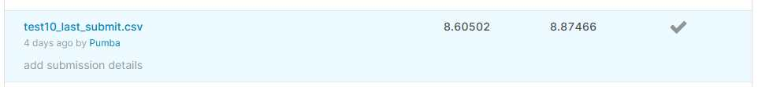

## Соревнование Thousand Facial Landmarks по курсу Computer Vision в MADE (data.mail.ru)
Студент: Вячеслав Введенский

**Описание:**

0. Выкинул ~3000 изображений, со смещенной разметкой. Можно было им сдвинуть разметку в правильное место и тоже использовать, но решил, что их всего 1%.
1. Аугментация - RandomCrop - случайным образом выбирал размер квадрата, который больше landmark и меньше, чем картинка. И случайным образом смещал его относительно разметки, но чтобы она осталась в нём. (такая была только на обучении, на валидации и тесте - из бейзлайна)
2. AdamW
3. обучался на MSE из бейзлайна, а на валидации метрику пересчитывал с учётом трансформации.
4. Эпох = пока падали метрики ~70
5. ResNet50, не морозил.

**Не делал или не зашло:**

С цветами, яркостью и блюром почему-то не стал играть. Может и зря.   
18-34-50 - давали улучшения. ResNet101 - как-то не пошёл. Пробовал другие предобученые модели - не было той, чтобы понравилось. Искал что-нибудь, чтобы быстрее училась.  
Пробовал Flip начальной картинки - для этого сделал корректный пересчёт точек. Явных улучшений не было, но были странные расшатывания модели. Когда на очередной итерации скор мог скакнуть сильно.  
Хотел как-нибудь использовать keypoint - но предобученая модель давала странный результат (находила на 1 лице несколько комплектов точек) и забросил.  
Пробовал в конце 2 FC слоя с дропаутом - не понравилось.  
Пробовал учить только 1 последний слой - тоже не зашло.  
Была мысль, что может зря выкидываю изображения со смещенной разметкой при обучении. Вдруг в тесте тоже такие будут. Но потом решил, что там такой дикий скор получается на них, что нет смысла. Да и задача у нас все-таки правильную разметку строить, а не угадывать когда она сдвинута.

